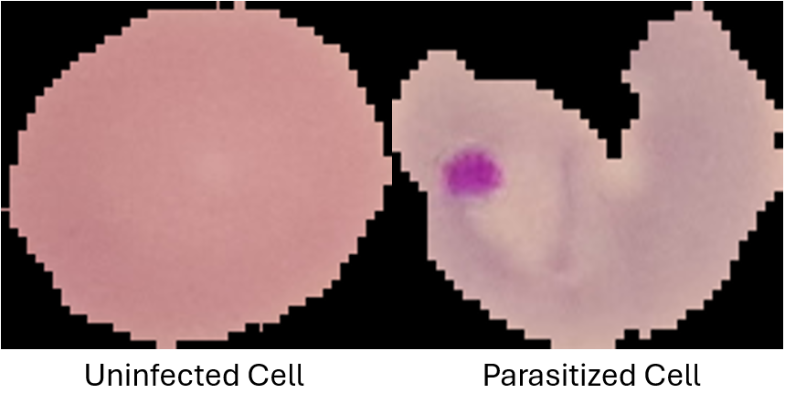
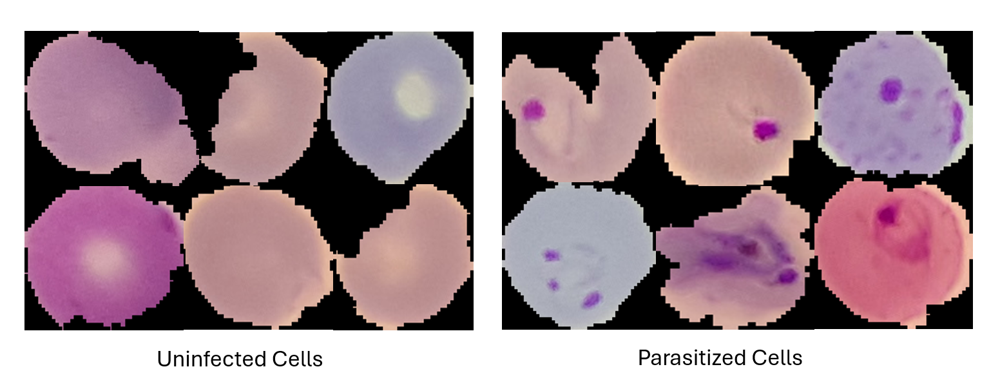

# Malaria Cell Classifier  
## BioHack Spring 2026  
### Team: Zahera Khatoon, Amanda Gale, Aamna Sheikh 

## Overview  
This project focuses on building a machine learning classifier to detect malaria-infected cells from microscopic blood smear images. Early and accurate detection of malaria is critical for effective treatment and disease management.

The dataset consists of labeled cell images classified as parasitized or uninfected, sourced from the NIH Malaria Cell Images Dataset.

## Quick Start

Install dependencies:
```
pip install -r requirements.txt
```

Run the project:
```
python main.py
```

## Dataset  
- Source: NIH Malaria Cell Images Dataset (Kaggle)  
- Total images: ~27,000  
- Subset used: 1,992 images  
  - 992 parasitized  
  - 1,000 uninfected  
- Balanced dataset (50/50 class distribution)  

## Feature Extraction  
From the images, the following features were extracted:  
- Area  
- Perimeter  
- Eccentricity  
- Mean intensity  
- Variance of intensity  

## Data Preprocessing  
- Images resized to uniform dimensions  
- Converted to grayscale  
- Background separated from cells  
- Outliers removed to improve model stability  
- Feature scaling applied using training data only  

## Methodology  
- Train-test split: 80:20  
- Models used:
  - Support Vector Classifier (SVC)  
  - Random Forest  
- Hyperparameter tuning using cross-validation and grid search  

## Results  
- Support Vector Classifier (SVC): ~87% accuracy  
- Random Forest: ~86% accuracy  

## Pipeline  
1. `1_import_data.py` – Data loading and feature extraction  
2. `2_clean_and_shape_data.py` – Data preprocessing and scaling  
3. `3_build_model.py` – Model training and evaluation  
4. `main.py` – Runs the full pipeline  

## Setup and Execution  

### Requirements  
- Python 3.12  
- pandas  
- numpy  
- scikit-learn  
- scikit-image  
- kagglehub  

### Installation  
Install required packages using:

pip install pandas numpy scikit-learn scikit-image kagglehub

### Run the Project  
Execute the full pipeline using:

python main.py

This will:

Import data and extract features
Clean and preprocess the dataset
Train and evaluate machine learning models

### My Contribution
Contributed to data preprocessing and feature extraction
Assisted in model development and evaluation
Participated in analysis and interpretation of results

### Conclusion
The models achieved strong classification performance using relatively simple features, indicating that morphological and intensity-based features are informative for malaria detection. However, more advanced image segmentation and feature engineering could further improve performance.

## Results Visualization

### Cell Comparison


### Segmentation Mask


## References
-NIH Malaria Dataset (Kaggle)
-Scikit-learn documentation
-scikit-image library
